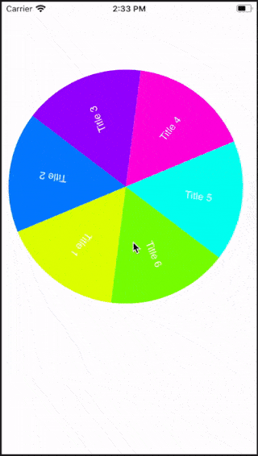

#WheelView

WheelView allows to create a rotatary view, which can have n number of segment with equal size.
Background color of each segment will be based on array of colors. If not provided, then random colors will be assigned to each segment.

